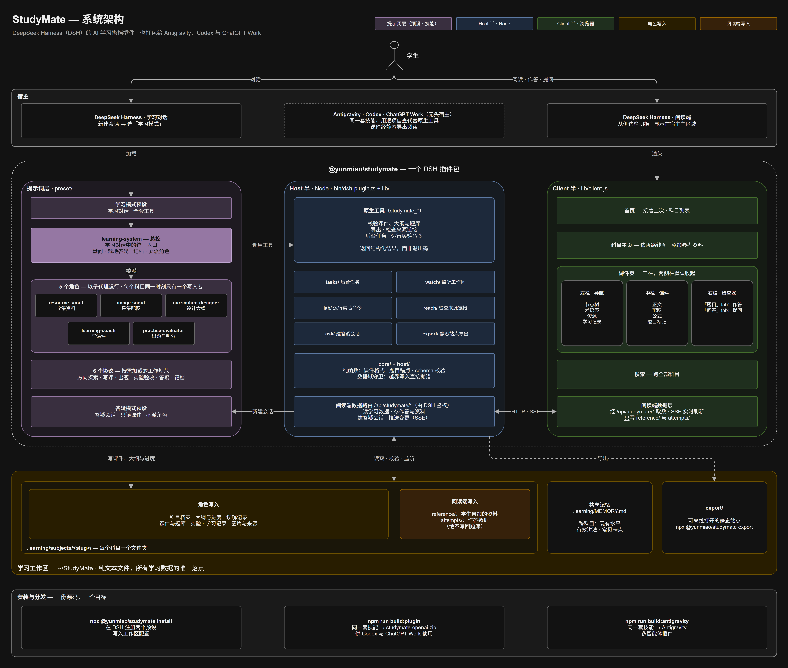

<p align="center"></p>

<h1 align="center">StudyMate</h1>

<p align="center"><b>你的AI学习搭档：定计划、讲知识、做项目，学透一门科目</b></p>

<p align="center">


</p>

<p align="center"><sub> StudyMate 是面向数学与计算机科目学习的助手，原则是「learn with doing」</sub></p>

<p align="center">简体中文 · <a href="README.en.md">English</a></p>

<p align="center"><a href="#快速开始">快速开始</a> · <a href="#它是什么">它是什么</a> · <a href="#核心功能">核心功能</a> · <a href="#常见问题">常见问题</a> · <a href="docs/使用/使用说明.md">使用说明</a> · <a href="docs/使用/Antigravity.md">Antigravity 说明</a></p>

<p align="center"></p>

## 前言

本项目原先是vibe出来给自己用的一个小项目，没想到有这么多人喜欢。但是vibe出来的东西有很多的问题，包括但不限于「文档过于臃肿且充满AI味、可读性极差」、「海量且无用的防御性代码」、「混乱的功能模块」。

虽然现在跑起来的效果也不差，但是跟我理想中的效果还是有很大差距

我觉得这样的东西对不起这么多的信任与star，我会直视这些问题，并且人工修改审查每一个文件，在未来的更新维护中给大家带来更好的体验，感谢大家的使用与支持，有任何建议都可以提个issue，本项目将长期维护。

## 快速开始

### DeepSeek Harness

**DSH 依赖**：DSH 0.1.5-rc.2+、Node.js（支持范围见 `package.json` 的 `engines`）。**不需要 Python**：引擎是随包发的 TypeScript 插件。

```bash
npx -y @yunmiao/studymate@latest install
```

- **桌面端（DeepSeek Harness Desktop）**：桌面端自带 DSH。它启动过一次之后，安装器就会用桌面端自带的 `dsh`，把「学习模式」装进它的 `desktop` 档位。装完**完全退出桌面端再重新打开**，新建会话时选「学习模式」。
- **官方 CLI**：先 `npm install -g @deepseek-ai/dsh@latest`，同一条安装命令默认注册到 `web` 档位，之后用 `dsh web` 启动。

**更新**：再次运行上述 `npx` 命令，然后重启对应的 DSH（桌面端完全退出再打开；CLI 重启并新建会话）。

- **第一次学习**：新建会话时选「学习模式」，说一句「我想学 [某个科目]」。学习数据直接写进配置好的学习工作区（暂存模式已删，没有"收尾问落点再搬一次"这一步）。
- **还没想好学什么**：在学习对话里说「我不知道学什么，帮我选方向」，可选探索后再决定是否开课；已有明确科目或恢复学习直接走原流程。
- **学习工作区默认在 `~/StudyMate`，所有课件与记忆均存放在工作区**；已有配置会沿用。
- **阅读在 DSH 的阅读端**：装好后新建会话时选「学习模式」，从侧边栏切到阅读端就能读课件、作答、搜资料——页面由阅读端实时渲染，不再预生成 HTML。
- **要离线看**：在会话里说一句「导出一份能离线看的」，或自己跑 `npx -y @yunmiao/studymate export`，产物落在 `<工作区>/export/`，入口是 `index.html`。

指定工作区、依赖安装、桌面端非默认安装位置和换机器续学见 [安装说明](docs/使用/安装.md)。

### Codex 和 ChatGPT Work

从 [最新 Release](https://github.com/Miaotofu01/Study-Mate/releases/latest) 下载 **studymate-openai.zip**，通过 Codex/ChatGPT 提供的插件导入入口导入（详见 [导入说明](docs/使用/Codex与ChatGPT.md)）。

**更新时下载最新版 ZIP，找到已有的插件链接，在浏览器中打开，选择上传新版本**

### Google Antigravity

在项目根目录运行以下命令一键构建并安装：

```bash
node bin/studymate.mjs build-antigravity --install
```

或者通过 `npm run build:antigravity` 构建 ZIP 包手动导入（详见 [Antigravity 说明](docs/使用/Antigravity.md)）。

## 它是什么

StudyMate 是一套**数学/计算机学习工作流、SKILL 与 DSH 插件**，支持 DSH（DeepSeek Harness）的「学习模式」预设、Google Antigravity 原生多智能体插件，也可打包为 Codex 和 ChatGPT Work 插件。它按需组织收集资料、采图、课程设计、讲解、练习评估五个角色；宿主支持时可委派给子代理，否则依次完成各角色工作。

- **课程组成：讲解|练习|项目实操**：每门课一份大纲——知识点按前置依赖排成路线图，每个知识点标课的类型「概念课 | 实操课 | 实验课」（大纲里写 `概念`／`实操`／`实验`）。学习进度落在文件里，每次新对话可继承已有进度。
- **跨科目共享记忆**：记住你的现有水平、哪种讲法有效、常见卡点，下一门课不用重新自我介绍。

## 为什么用它

| 常见做法         | 卡在哪                                           | StudyMate 的做法                                                                     |
| ---------------- | ------------------------------------------------ | ------------------------------------------------------------------------------------ |
| 直接跟 AI 聊天学 | 会话一长上下文就吃不下；聊完不留痕，下次从零开始 | 信息与偏好由记忆文件保存；每次会话只带相关记忆、上下文短；课件是教科书式的讲解与配图 |
| 看视频课 / 网课  | 质量参差不齐；付费；无法跟随前沿发展的节奏       | 讲解方式定制化；收集最新的资料与标准；完全开源                                       |


## 核心功能

**课程总览与大纲路线图**：总览页列全部科目与当前节点，点进去是那门课的知识点路线图，按依赖分层排开、按状态着色，点节点原地展开课件子卡片。


**课件是学习的主载体**：经典教材的讲解风格，丰富的配图，定制化的题目与项目目标。


阅读端就是产出本身：课件页由阅读端实时渲染，公式、配图、题目都在里面；需要一份能离线打开的副本时走导出（`npx -y @yunmiao/studymate export`，产物在 `<工作区>/export/`）。仓库里**不再入库示例工作区**——测试用的科目现造现弃（[ADR-0009](docs/adr/0009-示例与生成产物不再入库.md)），示例截图见上面的预览图。


## 用法示例

- **「我不知道学什么，帮我选方向」** → 一次聊一个问题，可跳过或先看建议；选定方向后补齐开课信息，确认后接回建课与首课流程（见 [可选方向探索](docs/使用/使用说明.md#可选先探索学习方向)）。
- **「我想学 C++ 打竞赛」** → 先盘问目的/程度/项目/实验方式，再产出大纲路线图与科目主页，开第一课。
- **带着指定教材自学** → 盘问结束后主动提供本地资料路径（讲义、笔记或教材目录），系统把教材转成 Markdown 放进 `reference/`（学生能翻），把它收集到的在线来源转成 Markdown 放进 `sources/`（写课对齐用）；大纲与课件都对着这批原文写。
- **贴一段看不懂的课文 + 「这里没懂」** → 主教练当场答一小段，记一条档案，送你回原位接着读。
- **「考考我」** → 现场出题 + 按可运行证据核验，给一份评估记录并更新进度。
- **「太简单了 / 没听懂」** → 换讲法（加边界与反例，或降一层抽象），并把这条偏好记进共享记忆。
  


## 配置与维护

日常要跑的命令只有一条，就是你装完之后自检的那条：

```bash
npm test
```

它不需要真实 DSH、浏览器或模型服务；测试自己造临时科目，不碰你的学习工作区。引擎脚本已经没有了（Python 随 #83 退役），**原生工具的清单与参数**只有两个出处：代码是 [`lib/tools/index.ts`](lib/tools/index.ts)，人读的那份是[原生工具契约](preset/skills/learning-system/references/tools.md)；各命令的前置、按需入口（真实浏览器、真实 DSH）与退出码语义见[测试说明](scripts/tests/README.md)——几处各是唯一出处，本文不重抄。

独立 Web 运行时（`study-mate-web/`，FastAPI + Next.js）曾落在主线，现已移出到分支 [`web/0.7.0-beta`](https://github.com/Miaotofu01/Study-Mate/tree/web/0.7.0-beta)——它自带一套引擎，与插件端读写同一份学习工作区，等有人把它适配到新引擎后合回。为什么移出、合回前必须满足什么，见 [ADR-0013](docs/adr/0013-Web运行时移出主线.md)。

## 项目结构

目录树、每个目录干什么、哪个文件归谁维护，见[工程约束](docs/规范/工程约束.md) §二 目录与规则归属
与[文件归属](docs/规范/文件归属.md)——两处各有唯一出处，这里不再抄一份。

DSH 侧就是**一个插件包**（`@yunmiao/studymate`）：Host 半注册原生工具与阅读端数据路由，Client 半是阅读端本体；预设与工作区配置由安装器写。学习数据默认位于独立的 `~/StudyMate`，无需保留源码仓库；详见 [安装说明](docs/使用/安装.md)。

<a href="docs/images/architecture.dark.png">
  <picture>
    <source media="(prefers-color-scheme: light)" srcset="docs/images/architecture.light.png" />
    
  </picture>
</a>

<sub>架构图源文件：[architecture.drawio](docs/images/architecture.drawio)（用 draw.io 打开编辑，改完重新导出 `architecture.light.png` 与 `architecture.dark.png`）</sub>

学习工作区里面长什么样（科目文件夹、课件、lab、档案、课型与题型），见 [使用说明 §六](docs/使用/使用说明.md#六学习数据存在哪)。

## 常见问题

<details>
<summary><b>装完看不到课件页</b></summary>

课件由**阅读端实时渲染**，不再预生成 HTML（页面模板已随 #83 退役）。在 DSH 里新建会话选「学习模式」，从侧边栏切到阅读端即可。要一份能离线打开的，跑 `npx -y @yunmiao/studymate export`，产物在 `<工作区>/export/`。
</details>

<details>
<summary><b>还需要装 Python 吗</b></summary>

不需要。引擎从 Python 脚本迁到了随包发的 TypeScript 插件（[ADR-0002](docs/adr/0002-引擎改用TypeScript.md)），安装器也不再探测 Python。只有一件事另外要 Node：导出静态页面时要一份 React（`npm i -g react react-dom`，或用 `STUDYMATE_REACT_DIR` 指过去）。
</details>

更多问题（手改 YAML 的坑、大纲改节点后指针为什么会错、能不能离线）见 [使用说明 §八 常见问题](docs/使用/使用说明.md#八常见问题)。

## 贡献 / License

- **项目交流群**(QQ)：161914370
- **参与开发**：[CONTRIBUTING.md](CONTRIBUTING.md)（改哪块先读哪份、本地怎么验、提交信息规范）
- **变更日志**：[CHANGELOG.md](CHANGELOG.md)
- **文档**：[使用说明](docs/使用/使用说明.md)（日常怎么用、课型与题型、检查与档案规则）· [Codex 与 ChatGPT](docs/使用/Codex与ChatGPT.md)（OpenAI 插件构建、安装与工作区）· [Antigravity 说明](docs/使用/Antigravity.md)（Antigravity 插件构建、多智能体协同与安装）· [课件内容格式](docs/规范/课件内容格式.md)（内容文件与题目位置的语法）· [阅读端呈现](docs/规范/阅读端呈现.md)（四个面「看起来对不对」的意图判据）· [文件归属](docs/规范/文件归属.md)（代称 ↔ 路径 ↔ 维护者）· [Agent 交接协议](docs/规范/Agent交接协议.md)（staged 子代理交付的机器边界）· [目标态规格](docs/设计/目标态规格.md)（重构后系统的形状与门禁）· [工程约束](docs/规范/工程约束.md)（目录约定、规则归属、原生工具指针）· [工作区数据骨架](templates/README.md)

### 提改动前先跑这几条

规矩见 [CONTRIBUTING.md](CONTRIBUTING.md)；各命令要跑什么、前置是什么见 [测试说明](scripts/tests/README.md)。

### License

MIT（见 [LICENSE](LICENSE)，版权 Cattofu）。

## Star 趋势

<p align="center">
  <a href="https://star-history.com/#miaotofu01/study-mate&Date">
    <picture>
      <source media="(prefers-color-scheme: dark)" srcset="https://api.star-history.com/chart?repos=miaotofu01/study-mate&type=date&theme=dark" />
      <source media="(prefers-color-scheme: light)" srcset="https://api.star-history.com/chart?repos=miaotofu01/study-mate&type=date" />
      
    </picture>
  </a>
</p>


