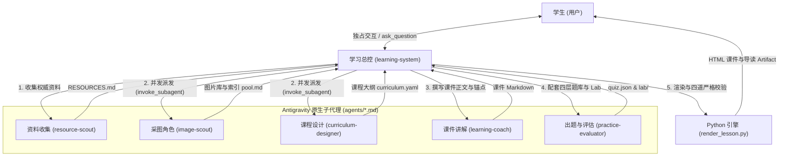

# 在 Google Antigravity 中使用 StudyMate

StudyMate 的 Google Antigravity 版本是面向 Antigravity 架构的原生多智能体插件包。它将 StudyMate 的学习工作流、HTML 课件引擎与 Antigravity 原生能力（子智能体机制 `invoke_subagent`、结构化交互模态 `ask_question`、安全沙箱 `run_command` 以及伴学 Artifacts）深度融合。

---

## 1. 架构总览

StudyMate 在 Antigravity 中采用 **主智能体（学习总控）+ 5 个专属后台子智能体** 的多智能体协同设计：



- **主智能体（`learning-system`）**：全局学习规划、用户对话通道、调度子代理、档案管理、课件渲染与四道严格校验。
- **5 个专属子智能体（`agents/`）**：
  - `resource-scout`：检索权威教材、官方文档与行业标准，产出资源清单与 `## Gaps`。
  - `image-scout`：抓取高质量概念图与流程图，校验尺寸格式，维护 7 列表头索引。
  - `curriculum-designer`：构建知识依赖拓扑有向无环图（DAG），制定标准大纲与实验课里程碑。
  - `learning-coach`：撰写教材级深度课件正文、真实场景钩子、LaTeX 数学公式与题目锚点。
  - `practice-evaluator`：全系统题目与评估的唯一 Owner，设计四层练习、整套 Lab 任务，基于真实运行证据核验与批改。
- **12 个完整 Skill 规范（`skills/`）**：全部采用标准规范 Frontmatter，在 Antigravity 中 100% 完整可见与常驻。

---

## 2. 安装、部署与更新

### 方式一：本地一键构建并安装（推荐）

在 StudyMate 项目根目录下运行：

```bash
node bin/studymate.mjs build-antigravity --install
```

该命令会自动：
1. 编译适配 Antigravity 的 5 个 Subagent、12 个 Skill 规范与交互协议。
2. 无损打包内置 Python 渲染器、校验脚本、Sayo UI 模板与 KaTeX 离线资产。
3. 原子替换安装到 Antigravity 插件目录：`~/.gemini/config/plugins/studymate`。

### 方式二：构建分发 ZIP 包手动导入

在项目根目录下运行：

```bash
npm run build:antigravity
```

构建产物位于：
- `dist/antigravity/studymate/`（完整插件解压目录）
- `dist/antigravity/studymate-antigravity.zip`（分发安装包）

通过 Antigravity IDE 的插件管理器选择导入该 ZIP 即可。

### 依赖环境准备

课件渲染与拓扑校验依赖 **Python 3.9+、PyYAML、jsonschema**：

```bash
python3 -m pip install pyyaml jsonschema
```

---

## 3. 使用说明与学习流程

### 1. 意图自动激活
得益于内置的 `rules/AGENTS.md` 规则，你在 Antigravity 对话中只要表达学习意愿：
- *“我想学计算机网络”*
- *“我想学 C++ 打竞赛”*
- *“我不知道学什么，帮我选方向”*

系统会自动激活 `learning-system` 进入学习工作流；日常写代码、修 Bug、代码审查或普通开发请求**绝不会误打扰**。

### 2. 交互式开课盘问（`ask_question`）
总控会调用 Antigravity 原生的交互式卡片逐步确认核心信息：
1. **现实目标与期望深度**：了解 / 能独立做项目 (Recommended) / 精通。
2. **前置知识自评**：核心数学/编程前置能力核验。
3. **主线项目选择**：给出 3 个以上有明确差异的实践项目供学生挑选。
4. **实操实验载体**：按项目性质选定 Jupyter Notebook、源码与测试或命令行等。

整个过程一次一个决策，收到回答直接向下推进，不反复发送“是否开始”等冗余确认。

### 3. 多智能体协同推进
- **并发调度**：资料收集就绪后，总控通过 `invoke_subagent` 数组同时并发派发 `image-scout`（采图建池）与 `curriculum-designer`（设计大纲 DAG）。
- **串行制作**：讲解角色完成课件正文后，出题评估角色进场配套练习题库与 Lab 任务包。
- **事件驱动**：子代理在独立后台上下文中执行，宿主在完成后自动通知总控，全程零轮询、零卡顿。

### 4. 课件呈现与伴读 Artifact
- **HTML 课件交付**：课件渲染完成后，总控在回复中提供可点击的本地绝对超链接：`[打开第 N 课：<标题>](file://<绝对路径>)`。提示在现代浏览器中直接打开，畅享 Sayo UI 侧边栏大纲、平滑滚动、代码高亮与离线 KaTeX 排版。
- **伴学 Artifact**：总控会在 `<appDataDir>/brain/<conversation-id>/` 写入 Mermaid 知识依赖路线图或本课导读 Artifact，提供结构化伴学视图。

### 5. 局部答疑与打扰控制（`local-qa`）
在阅读课件或做题过程中遇到疑惑时，直接将看不懂的段落或代码贴回对话并提问（如 *“这里没懂”*）。总控会在 200 字内精准解答，在后台静默记录误解（`misconceptions`），并引导你返回课件原位置继续学习，不打断主线流程。

---

## 4. 工作区与免授权暂存机制

- **默认学习工作区**：位于独立的 `~/StudyMate`，所有生成的科目、大纲路线图、课件、做题记录与跨科目共享记忆均保存在此处。可通过环境变量 `STUDYMATE_WORKSPACE` 自定义。
- **会话级免授权暂存**：如果对话是在某个具体代码仓中开启，新科目一律先在当前工作目录的 `.studymate-stage/<slug>` 暂存建课。全流程在会话当前目录内完成，全程零提权；制作完成后，由学生选定落点（默认工作区、桌面、文档目录或就地保留），单次安全搬移。
- **角色级隔离暂存**：子代理产物统一写入 `<subject_path>/.stage/<角色名>-<节点id>/deliver/<相对路径>`，严格隔离中间产物，杜绝并发冲突。

---

## 5. 常见问题排查

- **安装后技能未加载**：确认插件已正确部署在 `~/.gemini/config/plugins/studymate`，重启 Antigravity IDE 即可重新扫描并注册所有 12 个 Skill 与 5 个 Agent。
- **提示缺少 yaml 模块**：在系统终端运行 `python3 -m pip install pyyaml jsonschema` 安装依赖。
- **课件直接打开没有样式**：课件 HTML 会自动加载内置的 Sayo UI 静态样式库与 KaTeX 脚本，直接用 Chrome / Firefox / Edge 等现代浏览器打开即可。
- **子代理运行报错**：所有子代理交付物在合并前均经过机器校验器（`check_curriculum.py`、`check_pool.py`、`render_lesson.py --check`）强行把关，若未通过校验会打回重试，确保正式课件质量 100% 达标。

---

## 6. 开发者维护与测试

修改插件或适配逻辑后，运行以下命令验证：

```bash
# Antigravity 专用回归测试（ZIP导出、Agent准则、12技能Frontmatter校验）
npm run test:antigravity

# 514 条规范硬规则静态扫描
npm run test:static

# 全量功能回归测试
npm test
```
